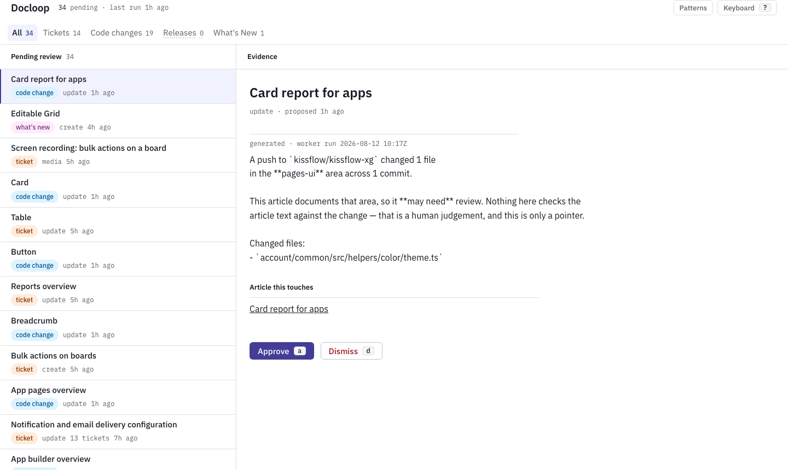
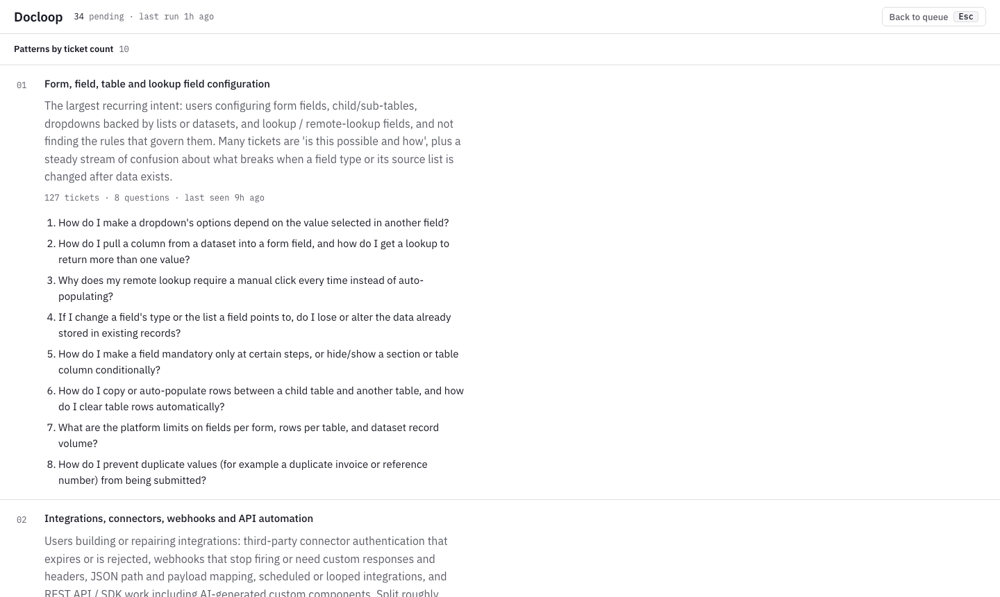
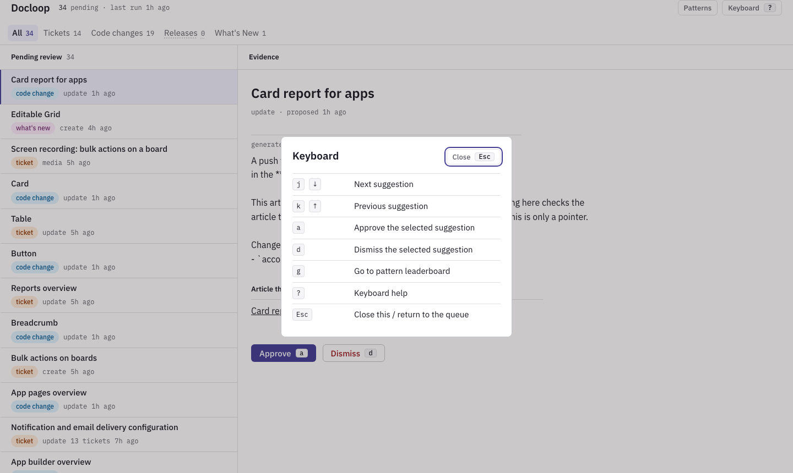
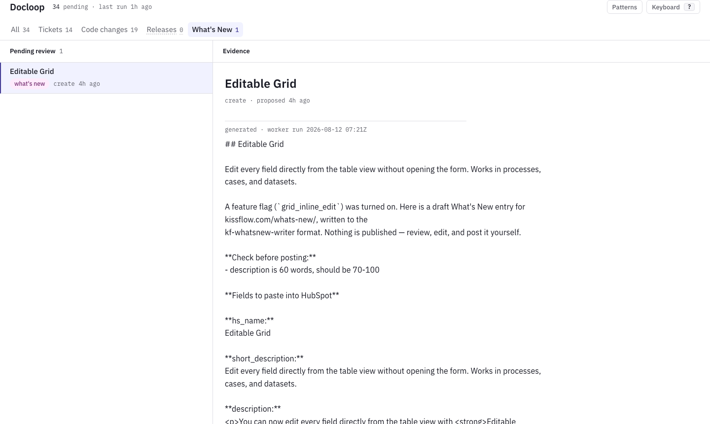
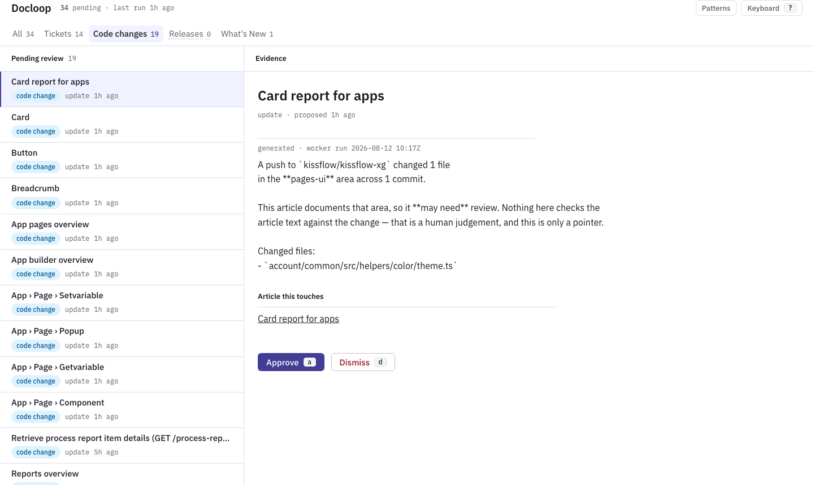

# Docloop

Docloop watches Kissflow for change and proposes documentation work in response. Support tickets
pile up on a topic, a push touches code an article documents, a release ships something
user-visible: each of those becomes a suggestion in a review queue. You approve or dismiss every
one. **Nothing publishes automatically, ever.**

This file tells you how to run it and use it. The other documents explain why it is built the way
it is, and are listed at the bottom.

## What actually works today

Be careful with this table. Several things in `BLUEPRINT.md` read as though they exist; only the
first four rows do.

| Capability | State |
|---|---|
| **A. Ticket mining** — cluster Intercom conversations into patterns and questionnaires | **Built.** Runs on demand. |
| **B1. Code staleness** — a push raises "these articles may be affected" | **Built.** Triggered by a GitHub push webhook. |
| **C. New docs** — a release proposes the documentation it needs | **Built.** Triggered by a published release. |
| **C. What's New** — a release or feature flag drafts a public changelog entry | **Built.** Triggered by a release or a feature-flag webhook. |
| Review queue, source filters, keyboard triage | **Built.** |
| Article index with full body text (646 docs) | **Built.** Imported from an export, not fetched live. |
| B2. UI staleness — replay documented steps in a browser | Designed, not built. Needs a test account. |
| Media pipeline — GIFs and narrated video for a suggestion | Designed, not built. Needs a demo account with no customer data. |
| Publish-back — push an approved edit to the doc platform | Designed, not built. |
| Unattended scheduling (launchd) | Written, not loaded. Every run today is one you start. |
| Public deployment | Not deployed yet. Target is Google Cloud Run — `scripts/deploy-gcp.sh` is written and waiting on a `gcloud auth login`. |

## What it looks like

**The review queue.** Four source tabs split the work by where it came from. The right pane shows evidence for the selected row: ticket questions, changed file paths, or a draft for review.


**Evidence for a suggestion.** Machine-authored text is marked as generated. Ticket text is rendered as plain text on purpose — it can contain anything a customer typed, and rendering it as HTML is how a stored script tag would run.



**Pattern leaderboard.** Ranked by ticket count. Each pattern lists the questions that produced it, so a writer can research what users actually ask before deciding what to write.



**Keyboard shortcuts.** The entire triage path — move through the queue, read evidence, approve, dismiss — works from the keyboard. Press `?` at any time.



The What's New and Code changes tabs each show a different kind of suggestion:





## Start it

You need Postgres running and a database called `docloop`. It is already installed here as a Homebrew
service, so it starts with the machine:

```bash
brew services list | grep postgres     # expect: postgresql@17 started
```

First time only, create the database and apply the schema:

```bash
createdb docloop
psql docloop -f web/schema.sql
```

Then start the dashboard:

```bash
cd web
npm install          # first time only
npm run dev
```

It serves on <http://localhost:3000>. It asks for one shared password, which lives in
`web/.env.local` as `DASHBOARD_PASSWORD`. That file also holds `DATABASE_URL`
(`postgresql://<you>@localhost:5432/docloop`) and the webhook secrets. It is deliberately not in
git; `web/.env.example` lists the names without the values.

The dashboard runs in this terminal. Close it and the site stops.

## Work the queue

<http://localhost:3000> opens on everything pending. The tabs across the top split it by where a
suggestion came from, and every row carries the same word as a coloured badge:

| Tab | Badge | Means |
|---|---|---|
| Tickets | `ticket` | Enough support tickets asked about this |
| Code changes | `code change` | A push touched code this article documents |
| Releases | `release` | A release shipped something that may need a new article |
| What's New | `what's new` | A drafted changelog entry, ready to edit and post |

A tab showing `0` is greyed but stays visible, and its empty state tells you how many suggestions
are waiting under the other tabs, so an empty filter is never mistaken for an empty queue.

You can work the whole queue from the keyboard. Press `?` for this list at any time:

| Key | Does |
|---|---|
| `j` / `↓` | Next suggestion |
| `k` / `↑` | Previous suggestion |
| `a` | Approve the selected suggestion |
| `d` | Dismiss it |
| `g` | Go to the pattern leaderboard |
| `?` | Keyboard help |
| `Esc` | Close the help, or return to the queue |

Approving records your decision. It does not publish anything and does not notify anyone.

The right-hand pane shows the evidence for whichever row is selected: the questions real tickets
asked, the files a push changed, or the full draft of a changelog entry. Suggestion text is shown
as plain text on purpose, so markdown like `## Editable Grid` appears literally. That is not a
bug. Ticket text can contain anything a customer typed, and rendering it as HTML is how a stored
script tag would run. `CONTRACT.md` §3.1 has the reasoning.

## Make it produce suggestions

Mining is the only workstream you run directly. The other three wait for something to happen in
GitHub and then pick up the work.

### Ticket mining, on demand

```bash
cd worker
node index.mjs                    # the real run
node index.mjs --days=7 --top=8   # narrower window, more patterns
node index.mjs --dry-run          # everything except the POST — see the warning below
```

> **`--dry-run` does not mean free.** It skips the POST, nothing else. Mining still reads 30 days
> of Intercom conversations and still makes both Claude calls, so a dry run costs about what a
> real one does: the last full run was roughly **$2.21**, and about six hours of runs came to
> around $9. If you want a cheap look, use `--days=7`, not `--dry-run`.
>
> A run takes several minutes. That is normal; it is reading hundreds of conversations.

Which runs cost money, since `--dry-run` is not the answer:

| Worker | Calls a model? | `--dry-run` costs? |
|---|---|---|
| `index.mjs` (mining) | Yes, twice | Yes, nearly full price |
| `newdoc.mjs` | Yes, once | Yes |
| `whatsnew.mjs` | Yes, once | Yes |
| `staleness.mjs` | No | No. It is free either way. |

`staleness.mjs` is pure lookup: it matches changed file paths against the area map and picks
articles. Nothing about it calls a model, which is why a push is the cheapest way to see the
system work end to end.

It needs `INTERCOM_TOKEN`, `DOCLOOP_API_URL` and `WORKER_API_KEY`. They are in `worker/.env.local`;
load them into your shell first:

```bash
cd worker
set -a && . ./.env.local && set +a
```

### The other three, triggered by an event

A GitHub push or release lands on a webhook, the webhook writes a job, and a worker claims it.
Nothing happens until you run the worker, so the order is always: trigger, then run.

| Trigger | Worker to run |
|---|---|
| Push to the default branch | `node staleness.mjs` |
| Release published | `node newdoc.mjs`, then `node whatsnew.mjs` |
| Feature flag turned on | `node whatsnew.mjs` |

A published release raises two jobs, because it produces two different things: `newdoc.mjs`
proposes the help article, `whatsnew.mjs` drafts the public changelog entry. Run both.

### Drafting articles with /doc-coauthoring

Once a release produces a `create` suggestion and a writer approves it, the next step is drafting
the article body. Docloop uses Claude Code skills for this:

1. **`/doc-prep`** — builds an outline from the graphify graph and fact-checks every behavioural
   claim against the codebase. Nothing is written from the model's memory of how the product works.
2. **`/doc-coauthoring`** — produces the article body following house style conventions.
3. **`/eos`** — an Elements of Style review pass for grammar, composition, and tone.

The approved suggestion carries the outline and fact-check results from step 1. Open it in Claude
Code and run `/doc-coauthoring` to draft the article. The skill follows the conventions in
`BLUEPRINT.md` §6 and the house style from `DESIGN.md`.

To try it without waiting for a real event, send the webhook yourself. The feature-flag one is the
easiest, since it only needs a bearer token:

```bash
cd web
TOKEN=$(grep '^GENERIC_HOOK_TOKEN=' .env.local | cut -d= -f2- | tr -d '"')
curl -s -X POST http://localhost:3000/api/hooks/generic \
  -H "authorization: Bearer $TOKEN" -H 'content-type: application/json' \
  -d '{"type":"feature-flag","flag":"grid_inline_edit","name":"Editable Grid",
       "description":"Users can now edit every field directly from the table view.",
       "area":"forms-fields","enabled":true}'
```

That answers `{"ok":true,"id":...,"jobs":["12"]}`. Then `cd worker && node whatsnew.mjs` and the
draft appears under **What's New**.

A GitHub push is the same idea but the payload must be signed, which is what GitHub itself would
do:

```bash
cd web
SECRET=$(grep '^GITHUB_WEBHOOK_SECRET=' .env.local | cut -d= -f2- | tr -d '"')
BODY='{"ref":"refs/heads/main","after":"abc123",
       "repository":{"full_name":"kissflow/kissflow-xg","default_branch":"main"},
       "commits":[{"added":[],"modified":["account/common/src/helpers/color/theme.ts"],"removed":[]}]}'
SIG="sha256=$(printf '%s' "$BODY" | openssl dgst -sha256 -hmac "$SECRET" | sed 's/^.*= //')"
curl -s -X POST http://localhost:3000/api/hooks/github \
  -H "x-github-event: push" -H "x-hub-signature-256: $SIG" \
  -H 'content-type: application/json' -d "$BODY"
```

Then `cd worker && node staleness.mjs`. That exact payload raises ten suggestions against the
forms-and-fields articles.

Every worker takes `--dry-run`, which claims the job and prints what it would send without writing
anything.

## The article index

Docloop can only say "this article may be affected" if it knows the article exists. That index is
795 articles: 646 product documentation topics with their full text, plus API and developer
reference pages.

It is imported from an export of the documentation site, not fetched live. To refresh it after a
new export:

```bash
node scripts/import-docs.mjs --file=<export.csv> | psql -d docloop
node scripts/map-doc-areas.mjs | psql -d docloop
```

The first loads titles, body text, category and last-updated date. The second tags each article
with the product areas it covers, which is what lets a changed file find the articles that
document it. Both are safe to re-run; they update in place rather than duplicating.

## Check that it is healthy

Four checks, none of which need a database, a network or an API key:

```bash
cd worker && node verify.mjs    # 56 checks
cd worker && node mutate.mjs    # 25 deliberate breakages, all must be caught
cd web    && node verify.mjs    # 31 checks
cd web    && npm run build && npx tsc --noEmit
```

They also run on GitHub for every push, so a red tick on a commit means one of these failed.

`mutate.mjs` is the unusual one and it is not ceremony. It breaks the customer-data guard on
purpose, one rule at a time, and requires the self-checks to notice. A test suite that still
passes when the thing it guards is broken is worse than no tests, because it is believed.

## Deploy it

It runs on this Mac today. To put it on the internet, it goes to **Google Cloud Run** in the
`kf-dev-research-ai` project, with **Cloud SQL Postgres** beside it.

**It is deployed.** <https://docloop-767032787396.us-central1.run.app>, holding the same 795
articles and the same queue. Log in with the same `DASHBOARD_PASSWORD`.

A cold start takes a few seconds. That is the service scaling up from zero, not a hang.

To deploy again after a code change:

```bash
gcloud auth login          # only if your token has expired
./scripts/deploy-gcp.sh
```

The script is idempotent. Running it twice does not create a second database or a second service,
and it never drops anything.

### What the first deploy hit, so you are not surprised twice

Both are fixed in the script, and both would otherwise look like something you did wrong.

- **Cloud SQL refused the cheap tier.** The project defaults to the ENTERPRISE_PLUS edition, which
  does not allow `db-f1-micro` at all. The tier has to be asked for with `--edition=ENTERPRISE`,
  which is the *cheaper* edition despite how the names read.
- **The build succeeded and the revision still failed.** Cloud Run runs as a service account
  (`…-compute@developer.gserviceaccount.com`) which could not read the secrets it was being handed.
  Each secret needs `roles/secretmanager.secretAccessor` granted to that account.

### The worker points at the deployed app

`worker/.env.local` now has `DOCLOOP_API_URL=https://docloop-767032787396.us-central1.run.app`, so
every worker you run on this Mac files its suggestions into the DEPLOYED queue.

The two environments have **separate databases**. A run against the wrong one is not lost, it is
filed in the other queue. To work against local again, set that variable back to
`http://localhost:3000`.

### What it costs

Deliberately the smallest tier of everything, because this is a proof of concept.

| Piece | Setting | Cost |
|---|---|---|
| Cloud Run | scales to zero, max 2 instances, 512Mi | Nothing while idle |
| Cloud SQL | `db-f1-micro`, 10GB HDD, zonal, no HA | Roughly **$8-10 a month** |

Cloud SQL is the whole running cost, because unlike Cloud Run it cannot scale to zero. To stop
paying for it without losing the data:

```bash
gcloud sql instances patch docloop-pg --activation-policy=NEVER   # stop
gcloud sql instances patch docloop-pg --activation-policy=ALWAYS  # start again
```

Region is `us-central1`, which is GCP's cheapest standard region. If the data needs to sit in
India instead, run `REGION=asia-south1 ./scripts/deploy-gcp.sh` — one variable, and about 15-20%
more.

**Backups are off.** That is affordable only because every row here is reproducible: articles from
`scripts/import-docs.mjs`, area tags from `scripts/map-doc-areas.mjs`, suggestions from re-running
the workers. If that stops being true, turn them on:
`gcloud sql instances patch docloop-pg --backup-start-time=03:00`.

**Secrets never sit in a readable field.** The database password is generated during deploy, never
printed, and stored in Secret Manager. `web/.env.local` is excluded from the upload by
`web/.gcloudignore`, so it is never baked into a container image.

The service is deliberately public, which is not an oversight: GitHub cannot present a Google
identity when it posts a webhook. Each route defends itself instead — an HMAC signature on the
GitHub hook, bearer tokens on the worker routes, and the shared password on everything else.

## Rules that do not bend

- **Nothing publishes automatically.** Every suggestion ends at a human decision.
- **Customer data from support tickets is the highest-stakes thing here.** Read `CONTRACT.md` §6
  before changing anything that stores text, and `BLUEPRINT.md` §10.1 for what the guard cannot do.
- **Ticket text is written by strangers and ends up in a model's prompt.** Treat stored text as
  data, never as instructions. `CONTRACT.md` §3.1 and `BLUEPRINT.md` §10.2.
- **Ask before**: loading the launchd schedule, creating real GitHub webhooks, running the graph
  refresh script, or any write back to Intercom.

## The other documents

| File | Answers | Read it if |
|---|---|---|
| [BLUEPRINT.md](./BLUEPRINT.md) | What are we building and why | You want to understand Docloop. **Start here.** |
| [PLAN.md](./PLAN.md) | What is being built this round | You want scope and sequencing |
| [CONTRACT.md](./CONTRACT.md) | How the two halves fit together | You are changing `web/` or `worker/` |
| [PRODUCT.md](./PRODUCT.md) | Who the dashboard is for | You are touching the interface |
| [DESIGN.md](./DESIGN.md) | What the dashboard looks like | You are touching the interface |

`CONTRACT.md` is frozen on purpose. It is the only reason `web/` and `worker/` could be built
independently without drifting apart. If an implementation disagrees with it, fix the
implementation, unless the contract is weaker than the guarantee it serves, which has happened
twice and is recorded in the amendment notes in §6.

## Layout

```
web/       Next.js App Router. Receives webhooks, stores events, serves the review dashboard.
           Deploys to Google Cloud Run; the database is Cloud SQL Postgres in the same project.
worker/    Plain Node, zero dependencies. Runs on this Mac: Claude Code, Playwright, ffmpeg.
scripts/   One-off imports and index maintenance. Each emits SQL; you pipe it to psql.
fixtures/  The taxonomy, the code and category maps, and shared test fixtures.
```

The split exists because of what the worker needs, not because of scale. It shells out to Claude
Code with your skills and your logged-in session, and later to Playwright and ffmpeg for media.
None of that belongs in a request-scoped container, on Cloud Run or anywhere else — so the web
half is hosted and the worker stays on a machine that has the toolchain and the credentials.
